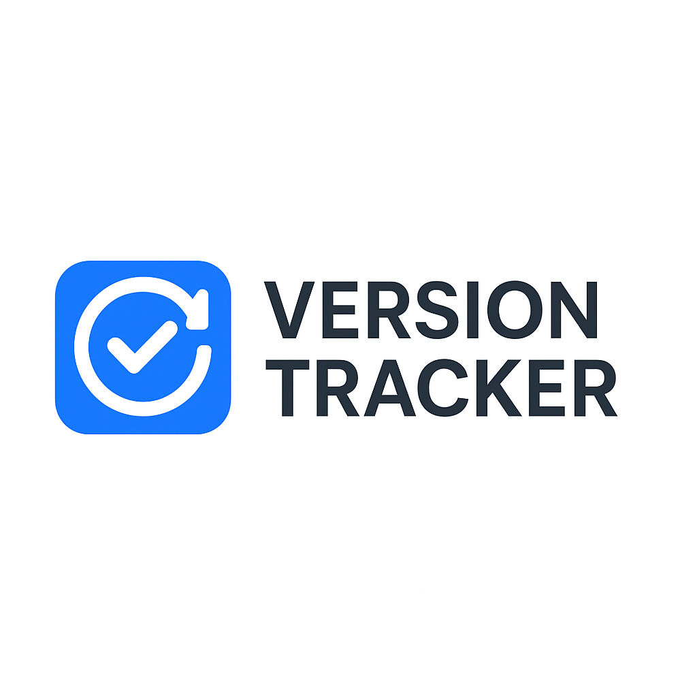

<p align="center">
  
</p>

# Versiontracker Update tool for macOS

[](https://pypi.org/project/versiontracker/)
[](https://pypi.org/project/versiontracker/)
[](https://github.com/docdyhr/versiontracker/actions/workflows/test.yml)
[](https://github.com/docdyhr/versiontracker/actions/workflows/lint.yml)
[](https://codecov.io/gh/docdyhr/versiontracker)
[](https://opensource.org/licenses/MIT)
[](https://github.com/psf/black)
[](https://pycqa.github.io/isort/)

* Name: Versiontracker
* Version: 0.6.2
* Programming language: Python 3
* Author: thomas
* Purpose: CLI versiontracker and update tool for macOS
* Release date: 21. Feb 2022 (Updated: March 2025)

## Overview

Versiontracker is a command-line tool for macOS that helps you manage applications installed outside of the App Store. It identifies applications that aren't managed through Apple's official channels and suggests which ones can be managed using Homebrew casks, making it easier to keep your applications up to date.

## Features

* List applications in `/Applications/` not updated by the App Store
* List all currently installed Homebrew casks
* Recommend which applications could be managed through Homebrew
* Check for outdated applications by comparing with latest Homebrew versions
* Identify applications that need updating and show version differences
* Export results in machine-readable formats (JSON and CSV)
* YAML configuration file support for persistent settings
* Fuzzy matching to identify applications across different naming conventions
* Parallel processing for faster operation
* Configurable blacklist to exclude specific applications
* Support for scanning additional application directories
* Secure command execution
* Color-coded console output for better readability
* Smart progress indicators with system resource monitoring
* Adaptive rate limiting based on CPU and memory usage
* Support for saving and loading query filters

## Requirements

- macOS (tested on 10.15 Catalina and later)
- Python 3.7 or later
- Homebrew package manager

## Installation

### Option 1: Clone the repository and install

```shell
# Clone the repository
git clone https://github.com/docdyhr/versiontracker.git
cd versiontracker

# Install requirements
python3 -m pip install -r requirements.txt --user

# Install the package (optional)
python3 -m pip install -e . --user
```

### Option 2: Set up a virtual environment

```shell
# Clone the repository
git clone https://github.com/docdyhr/versiontracker.git
cd versiontracker

# Create and activate a virtual environment
python3 -m venv .venv
source .venv/bin/activate

# Install requirements
pip install -r requirements.txt

# Install the package (optional)
pip install -e .
```

## Usage

Versiontracker provides a simple command-line interface with several options:

```
usage: versiontracker [-h] [-D DEBUG] [--rate-limit RATE_LIMIT]
                     [--max-workers MAX_WORKERS] [--no-progress]
                     [--blacklist BLACKLIST] [--additional-dirs ADDITIONAL_DIRS]
                     [--similarity SIMILARITY] [--export {json,csv}]
                     [--output-file OUTPUT_FILE] [-a | -b | -r | -o | -V]
                     [--generate-config] [--config-path CONFIG_PATH]

optional arguments:
  -h, --help            show this help message and exit
  -D DEBUG, --debug DEBUG
                        turn on DEBUG mode

Performance options:
  --rate-limit RATE_LIMIT
                        API rate limit in seconds (default: 3)
  --max-workers MAX_WORKERS
                        Maximum number of worker threads (default: 10)
  --no-progress         Disable progress bars

Filtering options:
  --blacklist BLACKLIST
                        Comma-separated list of applications to ignore
  --additional-dirs ADDITIONAL_DIRS
                        Colon-separated list of additional directories to scan for applications
  --similarity SIMILARITY
                        Similarity threshold for matching (0-100, default: 75)

Export options:
  --export {json,csv}   Export results in specified format (json or csv)
  --output-file OUTPUT_FILE
                        Specify the output file for export (default: print to stdout)

Configuration options:
  --generate-config     Generate a default configuration file at ~/.config/versiontracker/config.yaml
  --config-path CONFIG_PATH
                        Specify an alternative path for the configuration file (can be used both for
                        generating a config file with --generate-config and for using a custom config
                        file location when running the application)

  -a, --apps            return Apps in Applications/ that is not updated by App Store
  -b, --brews           return installable brews
  -r, --recommend       return recommendations for brew
  -o, --outdated        check for outdated applications compared to Homebrew versions
  -V, --version         show program's version number and exit
```

## Usage Examples

### List all applications not updated by App Store

```shell
python3 versiontracker-cli.py --apps
```

Or if installed:

```shell
versiontracker --apps
```

### List all installed Homebrew casks

```shell
python3 versiontracker-cli.py --brews
```

### Get recommendations for Homebrew installations

```shell
python3 versiontracker-cli.py --recommend
```

### Check for outdated applications

```shell
python3 versiontracker-cli.py --outdated
```

Or if installed:

```shell
versiontracker --outdated
```

### Export results to JSON format

```shell
python3 versiontracker-cli.py --apps --export json
```

### Save export results to a file

```shell
python3 versiontracker-cli.py --apps --export csv --output-file applications.csv
```

### Generate a default configuration file

```shell
python3 versiontracker-cli.py --generate-config
```

### Generate a configuration file in a custom location

```shell
python3 versiontracker-cli.py --generate-config --config-path ~/custom_config.yaml
```

### Run with debugging enabled

```shell
python3 versiontracker-cli.py --debug --recommend
```

## List applications based on your preferences

```shell
python -m versiontracker -a --blacklist="Xcode,Safari" --similarity 85
```

## Enhanced User Interface

VersionTracker includes several UI enhancements to improve usability:

### Color-Coded Output

All console output is color-coded for better readability:

1. Green: Success messages and up-to-date applications
2. Blue: Informational messages and progress updates
3. Yellow: Warning messages and unknown statuses
4. Red: Error messages and outdated applications

### Smart Progress Indicators

Long-running operations show progress bars with:

1. Estimated time remaining
2. CPU usage monitoring
3. Memory usage tracking
4. Adaptive refresh rates

### Adaptive Rate Limiting

When making network requests, VersionTracker intelligently adjusts rate limits based on:

1. Current CPU usage
2. Available memory
3. Network conditions

This ensures optimal performance regardless of system load.

### Query Filter Management

Save and reuse your favorite query settings:

```shell
# Save current settings
python -m versiontracker -a --blacklist="Xcode,Safari" --save-filter my-filter

# List all saved filters
python -m versiontracker --list-filters

# Load a saved filter
python -m versiontracker --load-filter my-filter

# Delete a filter
python -m versiontracker --delete-filter my-filter
```

## Configuration

### Configuration File

VersionTracker supports a YAML configuration file located at `~/.config/versiontracker/config.yaml` by default. You can generate this file using the `--generate-config` command line option.

You can also specify a custom configuration file location using the `--config-path` option:

```shell
# Generate a configuration file at a custom location
python3 versiontracker-cli.py --generate-config --config-path ~/custom_config.yaml

# Run the application using a custom configuration file
python3 versiontracker-cli.py --config-path ~/custom_config.yaml --apps
```

Example configuration file:

```yaml
# API rate limit in seconds
api-rate-limit: 3

# Maximum worker threads for parallel processing
max-workers: 10

# Similarity threshold for matching (0-100)
similarity-threshold: 75

# List of applications to exclude from results
blacklist:
  - Firefox
  - Chrome
  - Safari

# Additional application directories to scan
additional-app-dirs:
  - /Users/username/Applications
  - /opt/Applications

# Whether to show progress bars
show-progress: true
```

### Environment Variables

You can also configure VersionTracker using environment variables, which will override any settings in the configuration file:

```shell
# Set the API rate limit (seconds)
export VERSIONTRACKER_API_RATE_LIMIT=5

# Enable debug mode
export VERSIONTRACKER_DEBUG=true

# Set maximum worker threads
export VERSIONTRACKER_MAX_WORKERS=8

# Configure similarity threshold (0-100)
export VERSIONTRACKER_SIMILARITY_THRESHOLD=80

# Add applications to blacklist (comma-separated)
export VERSIONTRACKER_BLACKLIST=Firefox,Chrome,Safari

# Add additional application directories (colon-separated)
export VERSIONTRACKER_ADDITIONAL_APP_DIRS=/Users/username/Applications:/opt/Applications

# Disable progress bars
export VERSIONTRACKER_PROGRESS_BARS=false
```

## Testing

VersionTracker includes a test suite to ensure functionality. To run the tests:

```shell
# Activate your virtual environment if necessary
source .venv/bin/activate

# Install test dependencies
pip install pytest pytest-cov

# Run tests with coverage
pytest
```

This will run all tests and generate a coverage report showing which parts of the code are tested.

## Continuous Integration

VersionTracker uses GitHub Actions for continuous integration and deployment:

- **Testing**: Automatically runs the test suite on multiple Python versions
- **Linting**: Ensures code quality with flake8, black, and isort
- **Releases**: Automatically publishes new versions to PyPI when a release is created

The CI/CD pipeline helps maintain code quality and ensures that the application is always in a deployable state.

## Background

On macOS, not all apps are installed through the App Store. If you have many apps downloaded outside of Apple's App Store, it can be a hassle to keep them all updated - especially those you don't use every day. While download sites like macupdate.com or macdownload.com exist, they may not prioritize user privacy.

Package managers like Homebrew and MacPort make it possible to install and maintain many popular applications through the command line. Versiontracker helps bridge the gap between your current applications and what could be managed through Homebrew.

## Planned Improvements

* Add more package managers support (MacPorts, etc.)
* Add automatic update capabilities for Homebrew-manageable applications
* Improve performance with parallel API requests
* Add GUI interface
* Add support for application blacklisting
* Generate reports of outdated applications
* Support for more export formats

## License

[MIT](https://github.com/docdyhr/versiontracker/blob/master/LICENSE)
